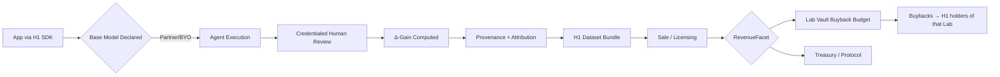

# H1 Labs Smart Contract Architecture
> Status: Aligned with smart contracts as of 2025-10-19

## Overview
H1 Labs uses the **EIP-2535 Diamond Standard** as the core proxy pattern, with modular facets for extensibility and per-lab deployed contracts for isolated state management.

---

## Architecture Diagram

```
┌─────────────────────────────────────────────────────────────────────────────┐
│                          H1 LABS PLATFORM ARCHITECTURE                       │
└─────────────────────────────────────────────────────────────────────────────┘

┌─────────────────────────────────────────────────────────────────────────────┐
│                             DIAMOND PROXY LAYER                              │
│  ┌───────────────────────────────────────────────────────────────────────┐  │
│  │  H1Diamond.sol (EIP-2535 Proxy)                                        │  │
│  │  • Fallback routing to facets via function selectors                   │  │
│  │  • Immutable singleton (1 instance for entire platform)                │  │
│  └───────────────────────────────────────────────────────────────────────┘  │
│                                     │                                         │
│                                     ├──────┐                                 │
│                ┌────────────────────┴──┐   └────────────────────┐            │
│                ▼                       ▼                         ▼            │
│  ┌──────────────────────┐  ┌─────────────────────┐  ┌────────────────────┐  │
│  │ Diamond Standard     │  │  Storage Library    │  │  Platform Facets   │  │
│  │ Management Facets    │  │                     │  │                    │  │
│  ├──────────────────────┤  ├─────────────────────┤  ├────────────────────┤  │
│  │ • DiamondCutFacet   │  │ • LibDiamond.sol    │  │ • LABSCoreFacet    │  │
│  │ • DiamondLoupeFacet │  │ • LibH1Storage.sol  │  │ • VaultFacet       │  │
│  │ • OwnershipFacet    │  │                     │  │ • BondingCurveFacet│  │
│  │ • SecurityFacet     │  │ Diamond Storage:    │  │ • LabPassFacet     │  │
│  └──────────────────────┘  │ - labs mapping      │  │ • RevenueFacet     │  │
│                             │ - nextLabId         │  │ • TreasuryFacet    │  │
│                             │ - labsToken addr    │  └────────────────────┘  │
│                             │ - vault mappings    │                          │
│                             │ - config params     │                          │
│                             └─────────────────────┘                          │
└─────────────────────────────────────────────────────────────────────────────┘

┌─────────────────────────────────────────────────────────────────────────────┐
│                          PLATFORM SINGLETON TOKENS                           │
│  ┌──────────────────────────────────────────────────────────────────────┐   │
│  │  LABSToken.sol (ERC20)                                                │   │
│  │  • Symbol: LABS                                                       │   │
│  │  • Platform's native utility/governance token                         │   │
│  │  • Owner-controlled minting (via Diamond)                             │   │
│  │  • Only 1 instance for entire platform                                │   │
│  └──────────────────────────────────────────────────────────────────────┘   │
│                                                                               │
│  ┌──────────────────────────────────────────────────────────────────────┐   │
│  │  ERC20Base.sol (Abstract Base Contract)                               │   │
│  │  • Gas-optimized ERC20 implementation with assembly                   │   │
│  │  • Inherited by: LABSToken, LabVault                                  │   │
│  │  • Includes batch transfer for airdrops                               │   │
│  └──────────────────────────────────────────────────────────────────────┘   │
└─────────────────────────────────────────────────────────────────────────────┘

┌─────────────────────────────────────────────────────────────────────────────┐
│                        PER-LAB DEPLOYED CONTRACTS                            │
│         (Each Lab gets its own isolated instances of these contracts)        │
│                                                                               │
│  ┌───────────────────────────────────────────────────────────────────────┐  │
│  │  Lab #1 Ecosystem                                                      │  │
│  │  ┌─────────────────────────────────────────────────────────────────┐  │  │
│  │  │  LabVault.sol (ERC20 + ERC4626-style)                            │  │  │
│  │  │  • IS THE H1 TOKEN for this lab                                  │  │  │
│  │  │  • Custom name/symbol per lab (e.g., "H1CARD", "H1BIO")          │  │  │
│  │  │  • Accepts $LABS deposits → mints H1 shares                      │  │  │
│  │  │  • Cooldown + exit caps for redemptions                          │  │  │
│  │  │  • Level tracking (L1/L2/L3) based on TVL                        │  │  │
│  │  │  • Admin controls (pause, cooldown, caps)                        │  │  │
│  │  └─────────────────────────────────────────────────────────────────┘  │  │
│  │                              │                                         │  │
│  │  ┌──────────────────────────┴──────────────────────────────────────┐  │  │
│  │  │  BondingCurveSale.sol                                            │  │  │
│  │  │  • Bootstrap mechanism for early participation                   │  │  │
│  │  │  • Buy H1 shares with LABS at NAV + 0.5% premium                 │  │  │
│  │  │  • Protocol fee & POL allocation for liquidity                   │  │  │
│  │  │  • Slippage protection & price manipulation guards               │  │  │
│  │  └──────────────────────────────────────────────────────────────────┘  │  │
│  │                                                                         │  │
│  │  ┌──────────────────────────────────────────────────────────────────┐  │  │
│  │  │  LabPass.sol (ERC721)                                             │  │  │
│  │  │  • NFT representing lab identity & level                          │  │  │
│  │  │  • Tracks level & app slots                                       │  │  │
│  │  │  • Soulbound by default (non-transferable)                        │  │  │
│  │  │  • Can be made transferable by governance                         │  │  │
│  │  └──────────────────────────────────────────────────────────────────┘  │  │
│  └───────────────────────────────────────────────────────────────────────┘  │
│                                                                               │
│  ┌───────────────────────────────────────────────────────────────────────┐  │
│  │  Lab #2 Ecosystem (same structure, different instances)               │  │
│  │  • LabVault (H1 token)                                                 │  │
│  │  • BondingCurveSale                                                    │  │
│  │  • LabPass NFT                                                         │  │
│  └───────────────────────────────────────────────────────────────────────┘  │
│                                                                               │
│  ┌───────────────────────────────────────────────────────────────────────┐  │
│  │  Lab #N Ecosystem (repeats pattern)                                    │  │
│  │  • LabVault (H1 token)                                                 │  │
│  │  • BondingCurveSale                                                    │  │
│  │  • LabPass NFT                                                         │  │
│  └───────────────────────────────────────────────────────────────────────┘  │
└─────────────────────────────────────────────────────────────────────────────┘
```

---

## Core Concepts

### 1. **Diamond Pattern (Singleton)**
- **H1Diamond.sol**: Single proxy contract for entire platform
- **Facets**: Modular logic contracts attached to diamond
  - Can be upgraded without changing state
  - Share storage via diamond storage pattern
- **Storage**: Centralized in `LibH1Storage.sol` and `LibDiamond.sol`

### 2. **Platform Token (Singleton)**
- **LABSToken**: Platform's primary utility token
- Used across all labs for staking, deposits, rewards
- Only 1 instance ever deployed

### 3. **Per-Lab Contracts (Multiple Instances)**
Each lab deploys its own isolated instances:

| Contract | Purpose | Token Type |
|----------|---------|------------|
| **LabVault** | The H1 token itself (ERC20 shares) | ERC20 + ERC4626-style |
| **BondingCurveSale** | Bootstrap liquidity mechanism | N/A (just logic) |
| **LabPass** | Identity & level NFT | ERC721 |

---

## Dual‑Intelligence SDK, Δ‑Gain, and Attribution (Architecture)

### Overview
- **Dual‑Intelligence:** Every SDK integration pairs an agent with a credentialed human. The agent executes; the human reviews and signs off. The output plus supervision metadata yields a verifiable artifact appropriate for regulated and semi‑regulated markets (healthcare first).
- **Base Model Declaration:** Each session declares the base model and version (partner provider or BYO). This enables Δ‑Gain computation.
- **Δ‑Gain Asset:** The supervised improvement vs the declared base model. Stored as content hash + metadata + signatures.
- **Attribution Ledger:** Contributors, validators, and the hosting Lab are attached onchain, enabling correct revenue routing on bundle sales.

### Contract Touchpoints
- `ProvenanceFacet` (planned): record dataset/event hashes, model IDs, signatures.
- `CredentialFacet` (planned): verify validator credentials for gated actions.
- `RevenueFacet` (exists): programmable splits and buyback budget accounting.
- `TreasuryFacet` (exists): executes buybacks/custody as policy evolves.

### Flow (Mermaid)


Regulatory targets: healthcare, then finance (AML/KYC), legal (privacy/privilege), defense (ITAR/EAR), robotics/industrial (safety), and media/creative (C2PA).

---

## Contract Count Summary

### Active Contracts: **22 total**

**Diamond Layer (10 contracts):**
- 1x H1Diamond.sol (proxy)
- 4x Diamond standard facets
- 4x Diamond interfaces
- 1x LibDiamond.sol (storage library)

**Platform Layer (7 contracts):**
- 6x Core facets (LABS, Vault, Bonding, LabPass, Revenue, Treasury)
- 1x LibH1Storage.sol (storage library)

**Token Layer (3 contracts):**
- 1x LABSToken.sol (platform token)
- 1x ERC20Base.sol (base contract)
- 1x LabPass.sol (NFT template)

**Per-Lab Deployment (2 contracts per lab):**
- 1x LabVault.sol (H1 token per lab)
- 1x BondingCurveSale.sol (bonding curve per lab)

### Drafts (Not Active): **9 contracts**
- ComplianceFacet.sol
- CredentialFacet.sol
- DiamondInitDraft.sol
- H1Token.sol (redundant with LabVault)
- H1TokenFactory.sol
- LabRegistry.sol
- Pausable.sol
- ProvenanceFacet.sol
- Timelock.sol

---

## Lab Creation Flow

```
1. User calls: LABSCoreFacet.createLab(name, symbol, domain)
   ↓
2. Diamond creates Lab entry in storage and auto-deploys LabVault (the H1 token)
   ↓
3. [Optional] User calls: BondingCurveFacet.deployBondingCurve(labId)
   ↓
4. Creates BondingCurveSale for bootstrap
   ↓
5. [Optional] User calls: LabPassFacet.deployLabPass(labId)
   ↓
6. Creates LabPass NFT for identity
```

---

## Key Design Decisions

### ✅ Why Diamond Pattern?
- **Upgradeability**: Facets can be upgraded without redeploying everything
- **Modularity**: Clean separation of concerns
- **Gas Efficiency**: Shared storage, single proxy overhead
- **Security**: Approved initializer whitelist prevents malicious upgrades

### ✅ Why LabVault IS the H1 Token?
- **Simplicity**: One contract = one purpose
- **ERC4626 Pattern**: Standard vault interface for shares
- **No Duplication**: Eliminates redundant H1Token.sol
- **Clear Ownership**: Each lab's vault is its own H1 token instance

### ✅ Why Per-Lab Deployments?
- **Isolated State**: Each lab has independent accounting
- **Customization**: Different names, symbols, parameters per lab
- **Security**: Compromise in one lab doesn't affect others
- **Scalability**: Can deploy thousands of labs without conflicts

---

## Import Graph (Simplified)

```
Diamond Facets
    ↓ import
LibH1Storage ← (shared state)
LibDiamond ← (diamond state)

Platform Facets
    ↓ import
LibH1Storage
    ↓ import/deploy
LabVault (extends ERC20Base)
BondingCurveSale (interacts with LabVault)
LabPass (ERC721)
LABSToken (extends ERC20Base)
```

---

## Gas Optimization Highlights

1. **ERC20Base**: Assembly-optimized transfer operations
2. **Struct Packing**: Lab struct optimized to 5 slots (was 6)
3. **RedeemRequest**: Packed into 2 slots (was 4)
4. **Immutable Variables**: labsToken, vault addresses
5. **Unchecked Math**: Where overflow is impossible
6. **Diamond Storage**: Single SLOAD for storage pointer

---

## Security Features

1. **Reentrancy Guards**: All state-changing functions protected
2. **Access Control**: Owner/admin modifiers on sensitive functions
3. **Input Validation**: Bounds checking on all parameters
4. **Cooldowns**: 7-day default on redemptions
5. **Exit Caps**: Max 20% daily exit to prevent bank runs
6. **Pause Mechanism**: Emergency circuit breaker on vaults
7. **Approved Initializers**: Whitelist for diamond upgrades
8. **Price Guards**: Bonding curve has price manipulation protection

---

## Future Extensibility

The diamond pattern allows adding new facets without redeploying:

**Potential Future Facets:**
- GovernanceFacet (voting, proposals)
- StakingRewardsFacet (yield distribution)
- InsuranceFacet (protocol insurance)
- AnalyticsFacet (on-chain metrics)
- IntegrationFacet (external protocol bridges)

**Each facet can be:**
- Added independently
- Upgraded individually
- Removed if obsolete
- Tested in isolation

---

## Conclusion

This architecture balances:
- **Centralization** (Diamond proxy) for upgradeability
- **Decentralization** (Per-lab contracts) for isolation
- **Simplicity** (22 active contracts) for maintainability
- **Flexibility** (Facet pattern) for future growth

The cleaned structure removes 9 redundant contracts while maintaining all core functionality!

