# **H1 Labs — Litepaper**  
> Status: Aligned with smart contracts as of 2025-10-19

### Advancing AI through provable, human‑validated data — powered by blockchain.

---

## 1. Mission, Goals, and Why Now

**Mission**  
H1 Labs is building the human‑first protocol for AI — a decentralized system where verified people enrich, validate, and monetize datasets with onchain provenance, compliance, and transparent economics.
Through our Dual‑Intelligence SDK, every app pairs an agent with a credentialed human, ensuring compliant data for regulated and semi‑regulated markets.

**Goals**  
- Launch a verifiable data economy spanning healthcare, robotics, law, art, and gaming.  
- Align incentives between contributors, validators, labs, and AI buyers through crypto‑native mechanics.  
- Make provenance, credentialing, and compliance default infrastructure for AI.

**Why Now**  
AI models demand trustworthy data. Today’s pipelines are opaque, legally risky, and misaligned with human contributors. H1 Labs merges blockchain guarantees (provenance, payments, programmable policy) with human expertise to create compliant, auditable datasets that enterprises can trust.

We target regulated and semi‑regulated markets — starting with healthcare — and expanding to finance (AML/KYC), legal (privacy/privilege), defense (ITAR/EAR), robotics/industrial (safety standards), and media/creative (C2PA).

---

## 2. Our Edge — Strengths at a Glance

- **Provenance by Design**: Every enrichment and validation emits an onchain trace (who, when, what).  
- **Credentialed Humans**: Domain experts verified via the Credentialing Portal; no anonymous crowdwork for regulated data.  
- **Programmable Compliance**: Domain rules are enforced at the contract layer (HIPAA, GDPR, AEH, C2PA).  
- **Dual‑Intelligence SDK (Agent + Human)**: Apps pair an agent with credentialed human oversight for compliant workflows in regulated and semi‑regulated markets.  
- **Two‑Token Model ($LABS ↔ H1)**: $LABS governs and stakes; each Lab’s H1 token is its vault share, enabling per‑lab economies.  
- **Modular Diamond Architecture**: EIP‑2535 facets make the system upgradeable, auditable, and extensible.  
- **Enterprise‑friendly UX**: SDK credit mode abstracts blockchain for Web2‑style apps.

---

## 2.5 Competitive Positioning — H1 vs The Field

H1 Labs uniquely combines **verified human intelligence, provenance, and compliance**. Unlike peers that focus on compute (Gensyn), model training (Bittensor), or data liquidity (Ocean), H1 targets regulated and semi-regulated markets with enterprise-grade trust.

<!-- Competitive comparison table replaced by visual component -->

**Why it matters for investors:** H1's compliance-first approach opens regulated markets (healthcare TAM ~$200B+ in data licensing) that competitors cannot access.

**Why it matters for developers:** Programmable compliance means SDKs can launch in regulated sectors without custom legal wrangling.

---

## 3. What You Can Do on H1

- **Create a Lab**: Stake and launch a domain Lab with its own H1 token (vault shares).  
- **Enrich & Validate**: Contribute to datasets; validators with credentials approve quality.  
- **Buy/Access Data**: AI firms purchase verified datasets; payments route transparently to stakeholders.  
- **Build Apps**: Use the H1 SDK to ship compliant, provenance‑aware applications quickly.

---

## 4. User Flows (High‑Level)

1) Lab Founder  
```
Connect Wallet → createLab(name, symbol, domain) → auto‑deploys LabVault (H1)
Deposit $LABS → mint H1 shares → reach Level thresholds → unlock app slots
Optional: deploy BondingCurve for bootstrap; deploy LabPass for identity
```

2) Contributor / Validator  
```
Sign up → Credentialing Portal (license/ID) → whitelisted for domain
Contribute/validate via apps (Scrubber, Second Opinion+, etc.)
Onchain provenance + rewards tracked to wallet
```

3) AI Buyer / Enterprise  
```
Discover datasets → purchase/license via RevenueFacet‑integrated flows
ETH routed: 50% Lab owner, 25% protocol treasury (H1 pool custody), 25% buyback budget
Auditable provenance & compliance artifacts for due diligence
```

---

## 4.5 Lab Creation & Growth Mechanics

### **Lab Lifecycle**

```mermaid
graph LR
    A[Stake $LABS] --> B[Deploy LabVault]
    B --> C[Domain Registered]
    C --> D{TVL Threshold}
    D -->|$10K-$50K| E[Level 1<br/>1 App Slot]
    D -->|$50K-$250K| F[Level 2<br/>2 App Slots]
    D -->|$250K+| G[Level 3<br/>3 App Slots]
    E --> H[Deposit More $LABS]
    F --> H
    H --> D
    C -.Optional.-> I[Deploy Bonding Curve]
    I --> J[Raise Capital<br/>NAV × 1.005]
    J --> K[Fees to Treasury]
    J --> L[POL to Liquidity]
    J --> M[Net to Vault]
    M --> D
    
    style A fill:#22c55e,stroke:#16a34a,stroke-width:2px,color:#000
    style B fill:#3b82f6,stroke:#2563eb,stroke-width:2px,color:#fff
    style C fill:#3b82f6,stroke:#2563eb,stroke-width:2px,color:#fff
    style E fill:#8b5cf6,stroke:#7c3aed,stroke-width:2px,color:#fff
    style F fill:#8b5cf6,stroke:#7c3aed,stroke-width:2px,color:#fff
    style G fill:#8b5cf6,stroke:#7c3aed,stroke-width:2px,color:#fff
    style I fill:#f59e0b,stroke:#d97706,stroke-width:2px,color:#000
    style J fill:#f59e0b,stroke:#d97706,stroke-width:2px,color:#000
```



**Stage 1: Initialization** — Lab creator stakes $LABS → auto-deploys isolated LabVault (H1 token) → domain registered uniquely.

**Stage 2: Growth via Deposits** — $LABS deposits → converted to H1 shares at NAV → unlock progressive **Levels** based on TVL creating natural scaling incentives.

**Stage 3: Bootstrap via Bonding Curve (Optional)** — Labs deploy **BondingCurveSale** for capital raise. Price formula: `NAV × 1.005` (0.5% premium).

<!-- Lab level progression chart -->

---

## 5. Architecture (Lite)

### Diamond Standard Design (EIP-2535)

H1 uses the **Diamond Standard (EIP-2535)** as its core proxy pattern: a single proxy routes to modular **facets** (logic contracts) while maintaining a unified storage layer. This enables upgradeability without state migration and extensibility without redeployment.


**Why Diamond Pattern?**
- **Upgradeability**: Add new compliance facets (GDPR, HIPAA, C2PA) without redeploying storage
- **Modularity**: Clean separation of concerns; each facet handles one domain
- **Gas Efficiency**: Shared storage; single proxy overhead scales to thousands of labs
- **Security**: Approved initializer whitelist prevents malicious upgrades

```
H1Diamond (EIP‑2535) ── routes to facets
  • DiamondCut / Loupe / Ownership / Security
  • Platform Facets: LABSCore, Vault, BondingCurve, LabPass, Revenue, Treasury

Singleton Token
  • LABSToken (ERC‑20): governance, staking, platform utility

Per‑Lab Contracts (deployed per lab)
  • LabVault (ERC‑20 shares, ERC‑4626‑style) = H1 token for that lab
  • BondingCurveSale (optional bootstrap)
  • LabPass (ERC‑721, identity & level)
```

Key storage (LibH1Storage): `labs`, `nextLabId`, `labsToken`, cooldown/exit caps, `protocolTreasury`, curve params, `reentrancyStatus`, and per‑lab addresses (`labIdToVault`, `labIdToLabPass`, `labIdToCurve`).

---

## 6. $LABS and H1 — Relationship, Mechanics, and the Economic Flywheel

- **$LABS (singleton ERC‑20):** Platform governance/staking asset. Set via `TreasuryFacet.setLABSToken`.  
- **H1 (per‑lab ERC‑20 shares):** Each Lab's `LabVault` is its own H1 token. Depositing $LABS mints H1 shares at NAV; redemptions return $LABS subject to cooldown and exit caps.  
- **Bonding Curve (optional):** `BondingCurveSale` buys H1 at NAV + 0.5% premium, routing fees/POL to treasury and depositing net $LABS to the lab's vault.  
- **Levels & App Slots:** LabVault tracks total assets to derive levels (L1/L2/L3) unlocking 1/2/3 app slots.  
- **Revenue Split (current implementation):** 50% to lab owner, 25% to protocol treasury (H1 pool custody), 25% retained for future buyback execution.

Economic intent: AI demand for verified datasets drives onchain payments that flow to Labs and treasury, with retained buyback budgets enabling future buy pressure mechanisms without dividend semantics.

---

### 6.5 Staking & Validator Rewards

**$LABS serves three functions:**
1. **Lab Creation:** Stake $LABS → mint H1 → unlock app slots and dataset economy
2. **Validation Rewards:** Contribute to datasets → earn $LABS grants + lab-specific H1 tokens
3. **Governance:** Hold $LABS → vote on protocol upgrades (future DAO)

**Validator Economics:**  
When a dataset sells (e.g., $100K), validators earn through:
- **Lab Revenue Share** (50% of sale): Proportionally split among validators → paid in lab-native H1 tokens
- **Protocol Grants** (25% of sale): Drawn from treasury → paid in $LABS for outstanding contributions
- **Buyback Pressure** (25% of sale): Retained for token repurchases → benefits all H1 holders via scarcity

This aligns incentives: more valuable contributions → higher rewards; increased lab success → increased validator payouts.

---

### 6.75 H1 Tokens — Per-Lab Economies

**What is H1?**  
H1 is **not a single token.** Each lab deploys its own H1 token (LabVault shares) representing:
- Fractional ownership of that lab's treasury
- Claim on future dataset sale revenue
- Participation in that domain's ecosystem

<!-- Token appreciation timeline chart -->

**Why H1 ≠ Traditional Stake-Reward Models:**

<!-- Comparison table replaced by visual component -->

---

### 6.9 Bonding Curves — Bootstrap Mechanics

**Why Bonding Curves?**  
Auto-adjusting price pegged to vault NAV eliminates ICO-style pricing risks. Buyers pay 0.5% premium; protocol captures 2–3% fees; remainder enters vault proportionally.

**Formula:** `price_per_share = vault_NAV × 1.005`

**Example — Robotics Lab Launch:**

```mermaid
graph TD
    A[Day 1: Lab Created<br/>$100K Deposit] --> B[H1-Robotics<br/>NAV: $1.00/share<br/>Curve: $1.005/share]
    B --> C[Level 1 Unlocked]
    C --> D[Day 7: $250K Raised<br/>via Bonding Curve]
    D --> E[Treasury: $5K fees<br/>+ $7.5K POL]
    D --> F[LabVault: $237.5K<br/>deposited at NAV]
    F --> G[New TVL: $337.5K<br/>New NAV: $1.125/share]
    G --> H[Level 2 Reached]
    
    I[🛡️ Safety Features]
    I --> J[Price Bounds<br/>0.001 - 1M]
    I --> K[Max 1-tx: 50%<br/>Flash Loan Protection]
    I --> L[Reentrancy Guards<br/>Slippage Checks]
    I --> M[Admin Pause<br/>Emergencies]
    
    style A fill:#22c55e,stroke:#16a34a,stroke-width:2px,color:#000
    style B fill:#3b82f6,stroke:#2563eb,stroke-width:2px,color:#fff
    style C fill:#8b5cf6,stroke:#7c3aed,stroke-width:2px,color:#fff
    style D fill:#f59e0b,stroke:#d97706,stroke-width:2px,color:#000
    style E fill:#ec4899,stroke:#db2777,stroke-width:2px,color:#fff
    style F fill:#ec4899,stroke:#db2777,stroke-width:2px,color:#fff
    style G fill:#3b82f6,stroke:#2563eb,stroke-width:2px,color:#fff
    style H fill:#22c55e,stroke:#16a34a,stroke-width:2px,color:#000
    style I fill:#64748b,stroke:#475569,stroke-width:2px,color:#fff
    style J fill:#64748b,stroke:#475569,stroke-width:1px,color:#fff
    style K fill:#64748b,stroke:#475569,stroke-width:1px,color:#fff
    style L fill:#64748b,stroke:#475569,stroke-width:1px,color:#fff
    style M fill:#64748b,stroke:#475569,stroke-width:1px,color:#fff
```



---

## 7.5 Why Blockchain Matters for H1

Blockchain is not ornament — it is the enforcement layer for provenance, compliance, and fair economics:

<!-- Blockchain benefits table replaced by visual component -->

---

## 8. Credentialing Portal & Compliance-as-Code

### Credential Lifecycle

H1 verifies professionals before they contribute to sensitive datasets:

```mermaid
graph TD
    A[📋 Apply<br/>ID + License Upload] --> B[🔍 Verify<br/>KYC-lite + Domain Check]
    B --> C[🎫 Mint Credential NFT<br/>Onchain Proof]
    C --> D[✅ Validate/Enrich Data<br/>Credentialed Access Only]
    D --> E[💰 Earn Rewards<br/>Build Reputation]
    E --> F[🔄 Renew/Upgrade<br/>Periodic Refresh]
    F --> D
    
    style A fill:#3b82f6,stroke:#2563eb,stroke-width:2px,color:#fff
    style B fill:#8b5cf6,stroke:#7c3aed,stroke-width:2px,color:#fff
    style C fill:#22c55e,stroke:#16a34a,stroke-width:2px,color:#000
    style D fill:#f59e0b,stroke:#d97706,stroke-width:2px,color:#000
    style E fill:#ec4899,stroke:#db2777,stroke-width:2px,color:#fff
    style F fill:#3b82f6,stroke:#2563eb,stroke-width:2px,color:#fff
```



**For investors:** Credentialing creates moat — enterprise clients will only trust data validated by verified professionals. This is table-stakes for regulated markets.

**For developers:** SDK integrates credential checks automatically:
```javascript
if (H1SDK.Credential.verify(wallet, 'HIPAA_Clinician')) {
   allowDataEnrichment(dataset);
}
```

### Compliance-as-Code Framework

Every Lab declares its domain (Healthcare, Legal, Robotics, etc.) at creation. The platform automatically enforces:

<!-- Compliance standards table replaced by visual component -->

**For investors:** Programmable compliance opens markets that competitors cannot access (healthcare data licensing alone is $200B+).

**For developers:** Add new compliance domains via governance without code changes.

---

## 9. Developer SDK (At a Glance)

- **Dual‑Intelligence Orchestration (Agent + Human)**: Built‑in co‑workflow primitives (assignment, handoff, review), human sign‑off, and audit trails.  
- **Identity & Credential**: Integrate credential checks for validators.  
- **Compliance**: Bind HIPAA/GDPR/AEH/C2PA policies per dataset/lab for regulated and semi‑regulated markets.  
- **Provenance Hooks**: Record enrichment/validation events onchain.  
- **Revenue & Splits**: Simple APIs aligned with `RevenueFacet`.  
- **Credit Mode**: Fiat‑friendly abstraction that still settles onchain.

### Dual‑Intelligence Dataflow (Δ‑Gain → Bundles → Buybacks)

```mermaid
sequenceDiagram
    participant App as App/SDK
    participant Agent as AI Agent
    participant Human as Credentialed Human
    participant H1 as H1 Protocol
    participant Buyer as AI Company
    
    App->>Agent: Select base model
    Agent->>Agent: Execute task
    Agent->>Human: Submit for review
    Human->>Human: Review & sign
    Human->>App: Approved + signature
    App->>H1: Compute Δ-Gain<br/>Record provenance
    H1->>H1: Aggregate into<br/>dataset bundles
    Buyer->>H1: Purchase/license data
    H1->>H1: Trigger revenue split
    H1->>App: Buyback pressure<br/>to originating Labs
    
    Note over Agent,Human: Dual-Intelligence<br/>Collaboration
    Note over H1,Buyer: Transparent<br/>Economics
```



---

## 9.5 Use Case Scenarios

<!-- Use case ROI comparison chart -->

---

## 10. Economic Flywheel

The H1 economy is designed as a **closed loop** that continuously strengthens as adoption increases:

```mermaid
graph LR
    A[🏗️ Labs Created<br/>Capital Staked] --> B[👥 Validators<br/>Enrich/Validate]
    B --> C[🤖 AI Companies<br/>Purchase Data]
    C --> D[💵 Revenue Split<br/>50% Lab / 25% Treasury<br/>25% Buyback]
    D --> E[📉 Buyback Execution<br/>H1 Supply Decreases]
    E --> F[📈 H1 Price Appreciates<br/>Lower Supply + NAV]
    F --> G[🚀 New Labs Incentivized<br/>Higher Token Value]
    G --> A
    
    style A fill:#22c55e,stroke:#16a34a,stroke-width:3px,color:#000
    style B fill:#3b82f6,stroke:#2563eb,stroke-width:2px,color:#fff
    style C fill:#8b5cf6,stroke:#7c3aed,stroke-width:2px,color:#fff
    style D fill:#f59e0b,stroke:#d97706,stroke-width:2px,color:#000
    style E fill:#ec4899,stroke:#db2777,stroke-width:2px,color:#fff
    style F fill:#22c55e,stroke:#16a34a,stroke-width:2px,color:#000
    style G fill:#3b82f6,stroke:#2563eb,stroke-width:2px,color:#fff
```



**Financial Model (Y1-Y3):**

<!-- Financial projections table replaced by interactive chart component -->

**Key Mechanic for Investors:** Revenue-driven buybacks create sustained upward pressure on $LABS and H1 tokens without dividend semantics. Unlike stake-reward models, H1's value comes from dataset sales — creating external, real demand.

---

## 11. Competitive Positioning — H1 vs The Field

H1 Labs uniquely combines **verified human intelligence, provenance, and compliance**. Unlike peers that focus on compute (Gensyn), model training (Bittensor), or data liquidity (Ocean), H1 targets regulated and semi-regulated markets with enterprise-grade trust.

<!-- Competitive positioning table replaced by visual component (see section 2.5) -->

**Why it matters:** H1's compliance-first approach opens regulated markets (healthcare TAM ~$200B+ in data licensing) that competitors cannot access. Programmable compliance means SDKs launch in regulated sectors without custom legal wrangling.

---

## 12. Technical Features (Selected)

- **Reentrancy Guards:** Shared via `LibH1Storage.reentrancyStatus` where needed (e.g., `RevenueFacet`).  
- **Upgradeable by Facet:** New domains or policy changes can be added without migrating state.  
- **Guardian Controls:** Cooldowns, daily exit caps, and pause mechanisms at the vault level.  
- **Security & Introspection:** Standard Diamond Loupe, Ownership, Security facets.
- **Price Bounds Protection:** Bonding curve prevents price manipulation via MIN/MAX bounds and 50% max change per tx.
- **Pause Mechanism:** Emergency admin controls for security incidents.

---

## 13. Use Cases (Initial)

- **Healthcare**: Scrubber (de‑identification), Second Opinion+ (AI‑human consultation), Imaging annotation.  
- **Creative & Gaming**: Provenance frameworks for art and game assets (C2PA‑aligned), attribution and licensing onchain.  
- **Robotics & Industrial**: Motion/vision datasets with validated safety metadata.
- **Legal & Financial**: Compliance-verified datasets (GDPR, AML/KYC aligned).
- **Education & Research**: FERPA-compliant educational datasets with attribution.

---

## 14. Roadmap (Condensed)

<!-- Roadmap timeline chart -->

---

## 15. Risks & Mitigations (Brief)

<!-- Risk matrix chart -->

---

## 16. Closing

H1 Labs unites verifiable human expertise with transparent token economics. By making provenance, credentialing, and compliance the substrate for AI data, we unlock trustworthy, enterprise‑grade datasets — and a sustainable crypto economy that rewards the people who create real intelligence.

The dual-token model ($LABS + H1), combined with revenue-driven buybacks and level-based app slots, creates a self-reinforcing flywheel where early adopters and high-quality validators are rewarded proportionally. This is not speculative tokenomics — it is provable economics tied to real dataset sales in regulated markets.


